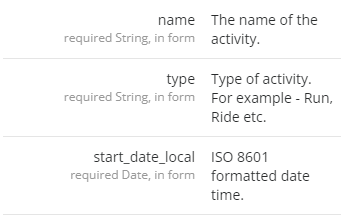
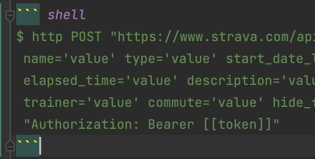
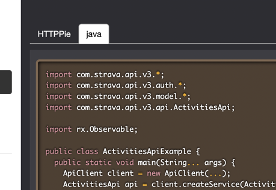

## Required in docs markdown
`Left area`
``` markdown
::::docs-panel{artributes}

    Add contents

::::
```

`Right area`
``` markdown
::::docs-panel{artributes}

    Add contents
    
::::
```

<br>

## Docs components

`docs-panel attributes`

| property | value | isRequired |   
| -------- | ----- | ---------- |   
| # or id  | left or right | true |
| target   | link or anchor | false |

> How to use   
> ```markdown
> ::::docs-panel{#id target=link}
>   // Add content
> ::::
> ```

<br>

`docs-http-method`

| property | value | isRequired |   
| -------- | ----- | ---------- |   
| method  | http method (ex: get) | true |
| url   | link (ex: /asd) | true |

> How to use
> ```markdown
> :docs-http-method{method=post url=/activities}
> ```
> 

<br>

`docs-table & docs-table-row`

| property | value | isRequired |   
| -------- | ----- | ---------- |   
| name | string value | true |
| requiredText | string required text | false |
| description | string description | true |

> How to use
> ```markdown
> :::docs-table
>   :docs-table-row{
>     name="name"
>     requiredText="requiredText"
>     description="The name of the activity."
>   }
> 
>   :docs-table-row{
>     name="name"
>     requiredText="requiredText"
>     description="<a href='/href'>The name of the activity.</a>"
>   }
> :::
> ```
> 

<br>

`docs-tab`

| property | value                                  | isRequired |   
| -------- |----------------------------------------| ---------- |   
| language  | programming lannguage (ex: javascript) | true |

> How to use
> ```markdown
> :::docs-tab{language=javascript}
>    write your code
> :::
> ```
> `code example` <br>
>  <br><br>
> `render` <br>
> 


<br>

`docs-comment`

> How to use
> ```markdown
> :::docs-comment
>    write anything
> :::
> ```
> `render`
> nothing


## Add attribute in markdown

`Example`
``` markdown
# Strava API v3
<!-- rehype:id=asd -->

[github](https://github.com)<<!--rehype:rel=external&style=color:pink;&data-name=kenny-->
```

> Output:
> ``` html
> <h1 id="asd">Strava API v3</h1>
>  
> <a href="https://github.com" rel="external" style="color:pink;" data-name="kenny">github</a>
> ```

> Reference
> https://github.com/jaywcjlove/rehype-attr/blob/main/README.md

<br>